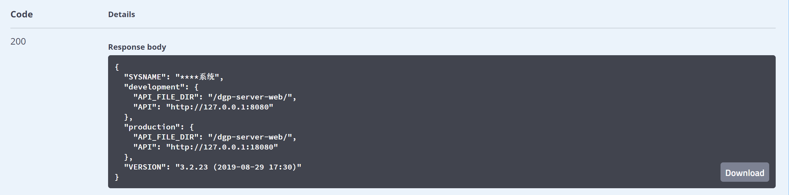

# 前端接入Nacos远程配置管理中心

环境测试地址：
nacos：http://127.0.0.1:8848/nacos  用户：nacos/nacos
后台中转地址：http://127.0.0.1:8080/nacos-config-frontend-web/swagger-ui.html#/

## 先说下nacos安装部署及简单使用
部署nacos1.4.x 以上，推荐：[nacos1.4.2](https://github.com/alibaba/nacos/releases/download/1.4.2/nacos-server-1.4.2.zip)  
启动nacos命令：
```
linux：sh startup.sh -m standalone
windows：cmd startup.cmd
```
默认访问：http://127.0.0.1:8848/nacos    默认用户：nacos/nacos
nacos配置命名空间


nacos自定义配置文件


以上完成了在nacos中新增配置文件，下面演示通过后台获取nacos配置文件的内容，然后前端接后台读取需要的配置文件内容。
公司环境nacos地址：http://127.0.0.1:8848/nacos  用户：nacos/nacos

## 前端通过后台中转获取Nacos配置文件内容

#### 部署后台读取nacos配置内容

部署 nacos-config-frontend-web.war
修改配置 bootstrap.yaml
```yaml
spring:
  cloud:
    nacos:
      config:
        enabled: true
        server-addr: 127.0.0.1:8848  # nacos 连接地址

# 白名单 允许请求的Ip
white:
  list:
    enabled: false  # 默认未启用，启用：只有在ips配置的Ip可请求通过
    ips:
      - 192.168.1.20
```
支持白名单配置，为了安全性。以上配置为公司测试环境
访问swagger地址：http://127.0.0.1:8080/nacos-config-frontend-web/swagger-ui.html#/
目前支持读取nacos中的 json、text、html等配置文件内容


返回数据


请求接口：http://127.0.0.1:8080/nacos-config-frontend-web/nacos/config/json/v1?dataid=a.json&group=DEFAULT_GROUP&namespace=frontend


#### 前端接入后台读取nacos配置

例如，读取json配置文件内容
http://127.0.0.1:8080/nacos-config-frontend-web/nacos/config/json/v1?dataid=a.json&group=DEFAULT_GROUP&namespace=frontend

>请求参数：dataid 配置文件名称，group 组，namespace 命名空间 ，参数是对应nacos配置的

获取json内容
```json
{
  "SYSNAME": "****系统",
  "development": {
    "API_FILE_DIR": "/dgp-server-web/",
    "API": "http://127.0.0.1:8080"
  },
  "production": {
    "API_FILE_DIR": "/dgp-server-web/",
    "API": "http://127.0.0.1:18080"
  },
  "VERSION": "3.2.23 (2019-08-29 17:30)"
}
```


